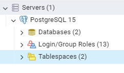
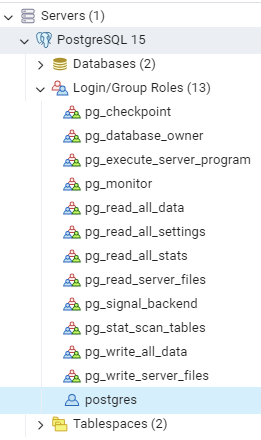
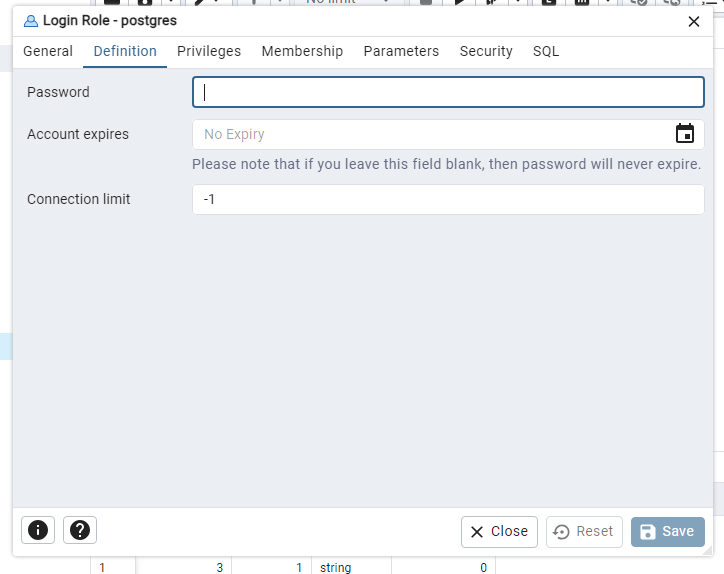

# ProductAPI - Teste Técnico

## Descrição
Uma API que poderá ser usada por outra aplicação cliente, com rotas definidas para realizar operações de CRUD e com um dashboard, que exibe preço médio e total de produtos para os tipos possível de produtos, definidos pelas regras de negócio.

A API também conta com uma implementação de autenticação usando HTTP Basic. Sendo necessário fornecer usuário e senha para realizar as requisições. Para esta API foi definido o seguinte usuário e senha para fins de teste:

```bash
    usuário: user
    senha: password
```
## Tecnologias
- **.NET 6**: Framework de desenvolvimento para a API.
- **PostgreSQL 15**: Banco de dados relacional para armazenar informações.
- **Entity Framework Core**: ORM para interação com o banco de dados.
- **Swagger**: Ferramenta para documentar e testar a API.

## Como usar

### Pré-requisitos
Antes de começar você precisará ter instalado em sua máquina o SDK do .NET 6, também será necessário que tenha instalado o banco de dados PostgreSQL e seu gerenciador pgAdmin.

### Configurações de usuário e senha no pgAdmin

Com o pgAdmin abertos será preciso configurar uma senha para o usuário 'postgres'.

1. Na aba lateral esquerda, vá até Login/Group Roles:
   


2. Clique com o botão direito no usuário 'postgres' e vá em 'Properties':
   


3. Com a janela 'Properties" aberta, vá até a guia Definition e, no campo password, digite "postgres@2024":



### Execução

1. Clone o repositório:
```bash
    git clone https://github.com/neiven13/ProductAPI.git
```

2. Navegue até a pasta do projeto:
```bash
    cd ProductAPI
```

3. Restaure os pacotes:
```bash
    dotnet restore
```

4. Instancie o banco de dados:
```bash
    dotnet ef databse update
```

4. Execute a aplicação:
```bash
    dotnet watch run
```
### Extras
* Foram usados os seguintes princípios SOLID: SRP (Single Responsibility Principle) e DIP (Dependency Inversion Principle), ambos com o objetivo de reduzir dependência de código, também facilitar manutenções futuras, atribuindo responsabilidade única nas classes e dependendo de abstrações, não de implementações.

### Pontos de melhoria de performance
1. Implementação de índices no banco de dados: melhoraria o desempenho das consultas feitas no banco de dados.

- No PostgresSQL bastaria executar o seguinte comando para criação de índices:
```sql
    CREATE INDEX idx_product_name ON Products(Name);
    CREATE INDEX idx_product_type ON Products(Type);
```

2. Implementação de acche em memória: melhoraria o tempo de resposta para dados que são lidos com mais frequência e não mudam sempre.
- Poderia ser implementado usando a interface `IMemoryCache` do pacote `Microsoft.Extensions.Caching.Memory`.
- Chamamos o método `AddMemoryCache()` na classe `Program.cs`, como um `service`.
- Por fim, usamos a injeção de dependência na classe `controller` onde será implementado o cache. No método onde se deseja cache, usamos o método `GetOrCreate`, que cria uma entrada na mémoria na primeira vez em que é usado. Na segunda vez em que a operção é executada, esse método verificará se existe uma entrada na memória e a carregará.
- É possível definir o tempo de expiração do cache usando `AbsoluteExpirationRelativeToNow`, definindo um tempo preciso. 
        
